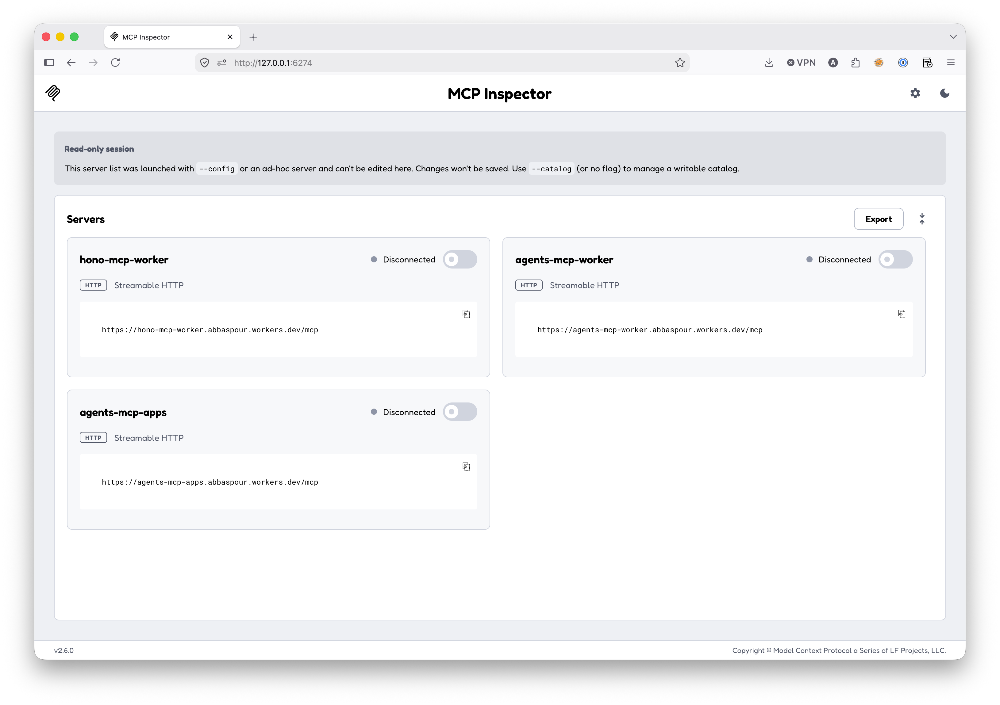
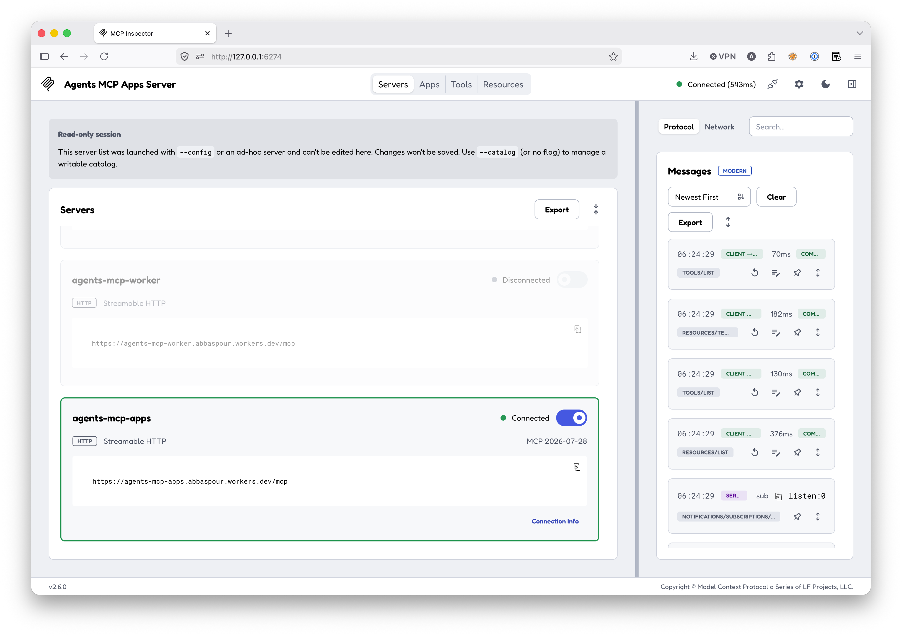
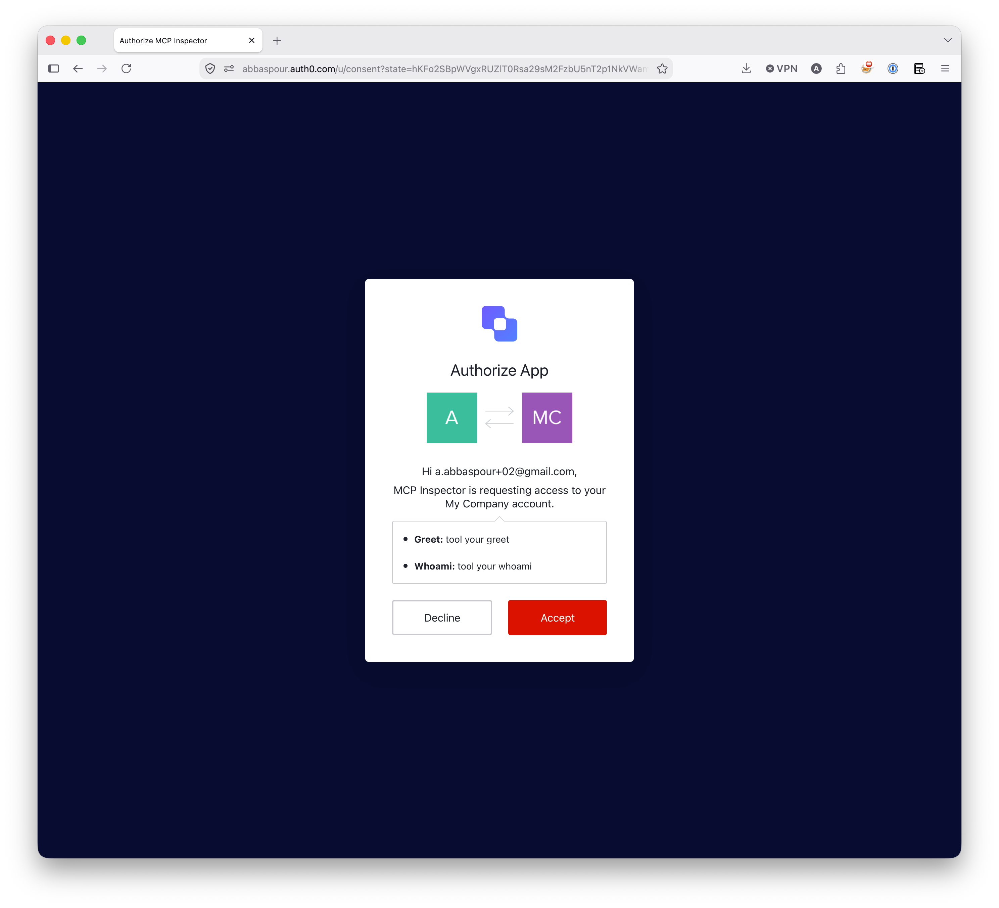
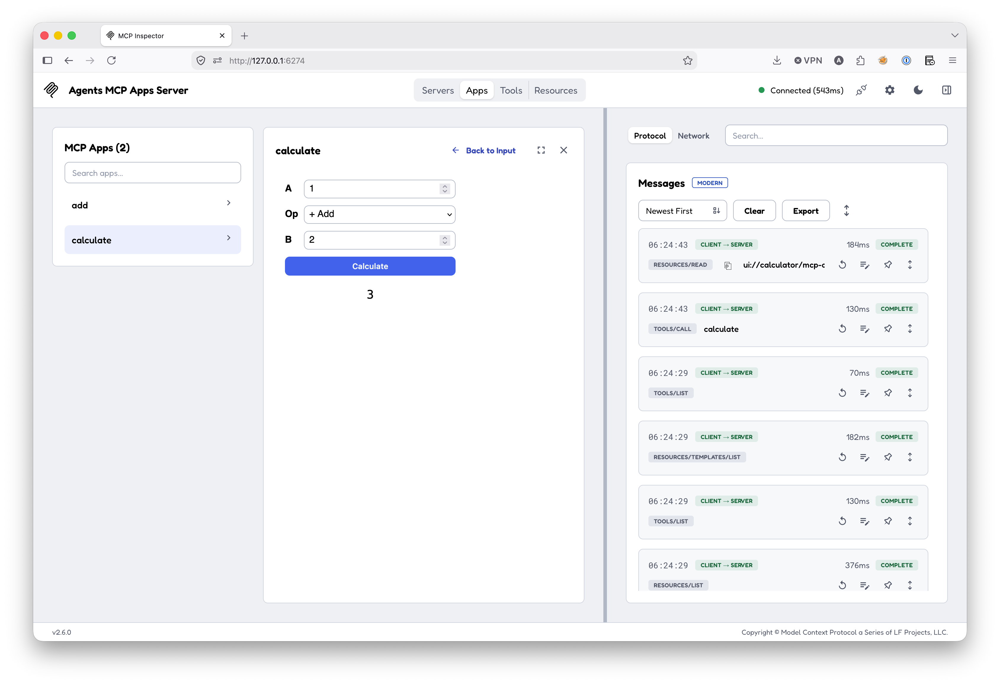

# Auth0 secured MCP servers deployed in Cloudflare Workers

Capabilities
- [CIMD](https://auth0.com/docs/get-started/auth0-overview/create-applications/register-applications-with-cimd)
- [Auth for MCP](https://auth0.com/ai/docs/mcp/get-started/authorization-for-your-mcp-server)
- [On-behalf-of (OBO)](https://auth0.com/docs/secure/call-apis-on-users-behalf/on-behalf-of-token-exchange) token exchange (coming soon)
- MCP Apps (coming soon)

SDKs
- [hono](https://hono.dev/)
- [agents](https://agents.cloudflare.com/)

## Screenshots

MCP Inspector list:

MCP Inspector Connect to Server

Auth0 Consent

MCP Inspector Rendered Apps
